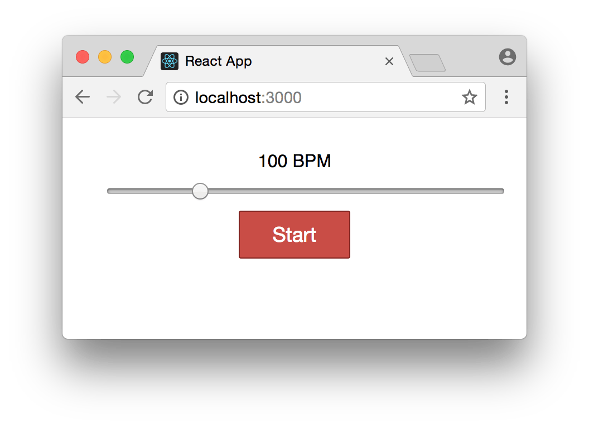

# Lesson #3: Metronome Project
In this lesson you will build a simple metronome app.

## Setup
Run the following code the create a barebones react app.

```
npx create-react-app react-metronome
```

After it finishes installing, cd into the folder and start your app.

```
cd react-metronome
npm start   # or yarn start
```

## Create the Metronome Component

The first thing we’ll do is replace the `App` component with our `Metronome` one. In `index.js`, just replace every occurrence of “App” with “Metronome”.

```js
import React from 'react';
import ReactDOM from 'react-dom';
import Metronome from './Metronome';
import registerServiceWorker from './registerServiceWorker';
import './index.css';

ReactDOM.render(<Metronome />, document.getElementById('root'));
registerServiceWorker();
```

And then create two new files: `src/Metronome.css`, and `src/Metronome.js`.

Start off Metronome.js with a barebones component to verify everything is working:

```js
import React, { Component } from 'react';
import './Metronome.css';

class Metronome extends Component {
  render() {
    return <div className="metronome">hi</div>;
  }
}

export default Metronome;
```
Your app should refresh in your browser (localhost:3000) and you should see hi.

## Render the Metronome UI

Now lets create the UI. This code should create a static button and slider.

```js
import React, { Component } from 'react';
import './Metronome.css';

class Metronome extends Component {
  render() {
    let bpm = 100;
    let playing = false;

    return (
      <div className="metronome">
        <div className="bpm-slider">
          <div>{bpm} BPM</div>
          <input type="range" min="60" max="240" value={bpm} />
        </div>
        <button>{playing ? 'Stop' : 'Start'}</button>
      </div>
    );
  }
}

export default Metronome;
```

Now add the following to `Metronome.css`

```css
.metronome {
  text-align: center;
  max-width: 375px;
  margin: 0 auto;
  padding: 30px;
}

.bpm-slider input {
  width: 100%;
  margin: 10px;
}

.metronome button {
  background: #c94d46;
  padding: 10px;
  border: 1px solid #832420;
  border-radius: 2px;
  width: 100px;
  color: #fff;
  font-size: 18px;
}
```
It should look like this:



You won’t be able to change anything yet, because we didn’t implement the onChange handler for the input control. It’s stuck at 100 (the value={bpm}).

## Initialize the State

The metronome’s BPM and whether it is “on” or “off” are good candidates to put in React’s state, so we’ll initialize state in the constructor and then use those variables in the `render` function:

```js
class Metronome extends Component {
  constructor(props) {
    super(props);

    this.state = {
      playing: false,
      count: 0,
      bpm: 100,
      beatsPerMeasure: 4
    };
  }

  render() {
    const { playing, bpm } = this.state;

    return (
      <div className="metronome">
        <div className="bpm-slider">
          <div>{bpm} BPM</div>
          <input type="range" min="60" max="240" value={bpm} />
        </div>
        <button>{playing ? 'Stop' : 'Start'}</button>
      </div>
    );
  }
}
```
Even though we’ve introduced state, the app is never changing that state, so none of the controls will work yet. But it should still render with no errors.

## Update the BPM

To make the slider work, we’ll add a handler function called `handleBpmChange` to the class, and pass it as the `onChange` prop to the input, like this:

```js
class Metronome extends Component {
  // ...

  handleBpmChange = event => {
    const bpm = event.target.value;
    this.setState({ bpm });
  }

  render() {
    const { playing, bpm } = this.state;

    return (
      <div className="metronome">
        <div className="bpm-slider">
          <div>{bpm} BPM</div>
          <input
            type="range"
            min="60"
            max="240"
            value={bpm}
            onChange={this.handleBpmChange} />
        </div>
        <button>
          {playing ? 'Stop' : 'Start'}
        </button>
      </div>
    );
  }
}
```

Now you should be able to drag the slider and watch the BPM change.

## Arrow Functions and `this`

The reason for using an arrow function is that `this` will be automatically bound to refer to the `Metronome` instance, and everything will work nicely.

If we’d used a regular function like `handleBpmChange() { ... }`, then the `this` binding would be lost when it gets passed to the `onChange` handler in `render`.

This is a quirk of Javascript: when you call a function as `this.foo()`, referring to `this` inside `foo` will do what you expect. But if you merely pass a reference to a function as `this.foo` (without calling it), then the value of `this` gets lost. If the idea of calling vs. passing a reference is confusing, read [this](https://daveceddia.com/react-redux-immutability-guide/#how-referential-equality-works-in-javascript) quick guide to how references work in JS.

Since event handler functions (like handleBpmChange) are almost always passed around by reference, it’s important to declare them as arrow functions. You can also bind them in the constructor.

## Loading the Audio Files
Let’s work on getting the “clicks” playing. First we need to import some sounds, and Webpack can do this for us by adding a couple import statements at the top of Metronone.js:

```js
import click1 from './click1.wav';
import click2 from './click2.wav';
```

You can download these sounds here:

* [click1.wav](https://daveceddia.com/freebies/react-metronome/click1.wav)
* [click2.wav](https://daveceddia.com/freebies/react-metronome/click2.wav)

Then in the constructor, we will create two Audio objects with those files, which we’ll then be able to trigger.

```js
class Metronome extends React.Component {
  // ...

  constructor(props) {
    // ... we're already initializing state ...

    // Create Audio objects with the files Webpack loaded,
    // and we'll play them later.
    this.click1 = new Audio(click1);
    this.click2 = new Audio(click2);
  }

  // ...
}
```

Add a `startStop` function to play a sound, and wire it up to call it from the button’s `onClick` handler:

```js
class Metronome extends React.Component {
  // ...

  startStop = () => {
   this.click1.play();
  }

  render() {
    const { playing, bpm } = this.state;

    return (
      <div className="metronome">
        <div className="bpm-slider">
          <div>{bpm} BPM</div>
          <input
            type="range"
            min="60"
            max="240"
            value={bpm}
            onChange={this.handleBpmChange} />
        </div>
        {/* Add the onClick handler: */}
        <button onClick={this.startStop}>
          {playing ? 'Stop' : 'Start'}
        </button>
      </div>
    );
  }
```

When you click the button, it should play a “click”.

## Starting and Stopping the Timer

Now we will add a timer. Here’s the new code (replace `startStop` with this):

```js
startStop = () => {
  if (this.state.playing) {
    // Stop the timer
    clearInterval(this.timer);
    this.setState({
      playing: false
    });
  } else {
    // Start a timer with the current BPM
    this.timer = setInterval(
      this.playClick,
      (60 / this.state.bpm) * 1000
    );
    this.setState(
      {
        count: 0,
        playing: true
        // Play a click "immediately" (after setState finishes)
      },
      this.playClick
    );
  }
};
```

Here’s how this works:

* If the metronome is playing, stop it by clearing the timer, and setting the `playing` state to false. This will cause the app to re-render, and the button will say “Start” again.
* If the metronome is not playing, start a timer that plays a click every few milliseconds, depending on the `bpm`.
* If you’ve used a metronome before, you know how the first beat is usually a distinctive sound (“TICK tock tock tock”). We’ll use `count` to keep track of which beat we’re on, incrementing it with each “click”, so we need to reset it when we start.
* Calling `setInterval` will schedule the first “click” to be one beat in the future, and it’d be nice if the metronome started clicking immediately, so the second argument to `setState` takes care of this. Once the state is set, it will play one click.

The second argument to `setState` is optional, and if you pass in a function there, React will call that function once the `setState` is done and the app has been updated.

You’ll notice this doesn’t play a sound, but rather calls out to `this.playClick` which we haven’t written yet. Here it is:

```js
playClick = () => {
  const { count, beatsPerMeasure } = this.state;

  // The first beat will have a different sound than the others
  if (count % beatsPerMeasure === 0) {
    this.click2.play();
  } else {
    this.click1.play();
  }

  // Keep track of which beat we're on
  this.setState(state => ({
    count: (state.count + 1) % state.beatsPerMeasure
  }));
};
```

With those functions in place, the metronome should work! Click “Start” and listen to it click away at 100 BPM.

You can change the tempo, but you’ll have to stop and start the metronome to make the change take effect. You can change that by modifying your `handleBpmChange` to the following:

```js
handleBpmChange = event => {
  const bpm = event.target.value;

  if (this.state.playing) {
    // Stop the old timer and start a new one
    clearInterval(this.timer);
    this.timer = setInterval(this.playClick, (60 / bpm) * 1000);

    // Set the new BPM, and reset the beat counter
    this.setState({
      count: 0,
      bpm
    });
  } else {
    // Otherwise just update the BPM
    this.setState({ bpm });
  }
};
```


