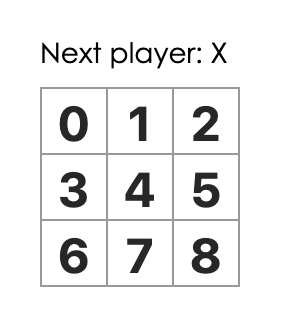

# Lesson #4: Tic Tac Toe React Project 
In this lesson we will continue learning more about React through an interactive tic-tac-toe game.

## Setup

1. Install another version of `create-react-app` by typing the following command

```
npx create-react-app tic-tac-toe
```
2. Delete all files in the src/ folder of the new project, but keep the src/ folder

```
cd tic-tac-toe
cd src

#if you're using Mac or Linux
rm -f *

#if you're using Windows
del *

#switch back to project folder
cd..
```

3. Add a file named `index.css` in the `src/` folder with this [CSS code](https://codepen.io/gaearon/pen/oWWQNa?editors=0100). You can do this by opening up the `tic-tac-toe` project in Atom or your IDE and creating a file through there.

4. Add a file named `index.js` in the `src/` folder with this [JS code](https://codepen.io/gaearon/pen/oWWQNa?editors=0010).

5. Add these three lines to the top of `index.js` in the `src/` folder:

```js
import React from 'react';
import ReactDOM from 'react-dom';
import './index.css';
```

Now if you run `npm start` in the project folder and open http://localhost:3000 in the browser, you should see an empty tic-tac-toe field.

## Inspecting Starter Code
Open `src/index.js`.

This Starter Code is the base of what we’re building. We’ve provided the CSS styling so that you only need to focus on learning React and programming the tic-tac-toe game.

By inspecting the code, you’ll notice that we have three React components: Square, Board, Game.

## Passing Data through props
To get our feet wet, let’s try passing some data from our Board component to our Square component.

In Board’s `renderSquare` method, change the code to pass a prop called value to the Square:

```js
class Board extends React.Component {
  renderSquare(i) {
    return <Square value={i} />;
  }
```

Change Square’s `render` method to show that value by replacing `{/* TODO */}` with `{this.props.value}`:

```js
class Square extends React.Component {
  render() {
    return (
      <button className="square">
        {this.props.value}
      </button>
    );
  }
}
```

After you should see a number in each square:



Congratulations! You’ve just “passed a prop” from a parent Board component to a child Square component. Passing props is how information flows in React apps, from parents to children.

## Making an interactive component

Let’s fill the Square component with an “X” when we click it. First, change the button tag that is returned from the Square component’s render() function to this:

```js
class Square extends React.Component {
  render() {
    return (
      <button className="square" onClick={function() { alert('click'); }}>
        {this.props.value}
      </button>
    );
  }
}
```

Now when you click a square, an alert should pop up.

Now we want the Square component to “remember” that it got clicked, and fill it with an “X” mark. We will do this by storing the current value of the Square in this.state, and change it when the Square is clicked. Add a constructor to the class to initialize the state:

```js
class Square extends React.Component {
  constructor(props) {
    super(props);
    this.state = {
      value: null,
    };
  }
```

Now we’ll change the Square’s `render` method to display the current state’s value when clicked:

* Replace `this.props.value` with `this.state.value` inside the `<button>` tag.
* Replace the `onClick={...}` event handler with `onClick={() => this.setState({value: 'X'})}`.
* Put the `className` and `onClick` props on separate lines for better readability.

```js
render() {
    return (
      <button className="square" onClick={() => this.setState({value: 'X'})}>
        {this.state.value}
      </button>
    );
  }
 ```
 
By calling `this.setState` from an `onClick` handler in the Square’s `render` method, we tell React to re-render that Square whenever its `<button>` is clicked. After the update, the Square’s `this.state.value` will be `'X'`, so we’ll see the `X` on the game board. If you click on any Square, an `X` should show up.
 
We now have the basic building blocks for our tic-tac-toe game. To have a complete game, we now need to alternate placing “X”s and “O”s on the board, and we need a way to determine a winner.

## Finishing up the game

Currently, each Square component maintains the game’s state. To check for a winner, we’ll maintain the value of each of the 9 squares in one location.

The best approach is to store the game’s state in the parent Board component. The Board component can tell each Square what to display by passing a prop, just like we did when we passed a number to each Square.

To collect data from multiple children, or to have two child components communicate with each other, you need to declare the shared state in their parent component instead.

Add a constructor to the Board and set the Board’s initial state to contain an array of 9 nulls corresponding to the 9 squares:

```js
class Board extends React.Component {
  constructor(props) {
    super(props);
    this.state = {
      squares: Array(9).fill(null),
    }
  }

```

We will modify the Board to instruct each individual Square about its current value ('X', 'O', or null). We have already defined the squares array in the Board’s constructor, and we will modify the Board’s renderSquare method to read from it:

```js
renderSquare(i) {
    return <Square value={this.state.squares[i]} />;
  }
```

We need to create a way for the Square to update the Board’s state. Since state is considered to be private to a component that defines it, we cannot update the Board’s state directly from Square.

Instead, we’ll pass down a function from the Board to the Square, and we’ll have Square call that function when a square is clicked. We’ll change the `renderSquare` method in Board to:

```js
renderSquare(i) {
    return (
      <Square value={this.state.squares[i]} onClick={() => this.handleClick(i)}/>
    );
  }
```

Now we’re passing down two props from Board to Square: `value` and `onClick`. The `onClick` prop is a function that Square can call when clicked. We’ll make the following changes to Square:

* Replace `this.state.value` with `this.props.value` in Square’s `render` method
* Replace `this.setState()` with `this.props.onClick()` in Square’s `render` method
* Delete the `constructor` from Square because Square no longer keeps track of the game’s state

After these changes, the Square component looks like this:

```js
class Square extends React.Component {
  render() {
    return (
      <button className="square" onClick={() => this.props.onClick()}>
        {this.props.value}
      </button>
    );
  }
}
```

When we try to click a Square, we should get an error because we haven’t defined `handleClick` yet. We’ll now add `handleClick` to the Board class (under the constructor):

```js
handleClick(i) {
    const squares = this.state.squares.slice();
    squares[i] = 'X';
    this.setState({squares: squares});
  }
```
We now need to fix an obvious defect in our tic-tac-toe game: the “O”s cannot be marked on the board.

We’ll set the first move to be “X” by default. We can set this default by modifying the initial state in our Board constructor:

```js
class Board extends React.Component {
  constructor(props) {
    super(props);
    this.state = {
      squares: Array(9).fill(null),
      xIsNext: true,
    };
  }
```

Each time a player moves, `xIsNext` (a boolean) will be flipped to determine which player goes next and the game’s state will be saved. We’ll update the Board’s `handleClick` function to flip the value of `xIsNext`:

```js
handleClick(i) {
    const squares = this.state.squares.slice();
    squares[i] = this.state.xIsNext ? 'X' : 'O';
    this.setState({
      squares: squares,
      xIsNext: !this.state.xIsNext,
    });
}
```

With this change, “X”s and “O”s can take turns. Try it!

Let’s also change the “status” text in Board’s `render` so that it displays which player has the next turn:

```
  render() {
    const status = 'Next player: ' + (this.state.xIsNext ? 'X' : 'O');

    return (
      // the rest has not changed
```

## Declaring a Winner

Now that we show which player’s turn is next, we should also show when the game is won and there are no more turns to make. Copy this helper function and paste it at the end of the file:

```js
function calculateWinner(squares) {
  const lines = [
    [0, 1, 2],
    [3, 4, 5],
    [6, 7, 8],
    [0, 3, 6],
    [1, 4, 7],
    [2, 5, 8],
    [0, 4, 8],
    [2, 4, 6],
  ];
  for (let i = 0; i < lines.length; i++) {
    const [a, b, c] = lines[i];
    if (squares[a] && squares[a] === squares[b] && squares[a] === squares[c]) {
      return squares[a];
    }
  }
  return null;
}
```
 
We will call `calculateWinner(squares)` in the Board’s `render` function to check if a player has won. If a player has won, we can display text such as “Winner: X” or “Winner: O”. We’ll replace the `status` declaration in Board’s `render` function with this code:

```js
 render() {
    const winner = calculateWinner(this.state.squares);
    let status;
    if (winner) {
      status = 'Winner: ' + winner;
    } else {
      status = 'Next player: ' + (this.state.xIsNext ? 'X' : 'O');
    }

    return (
      // the rest has not changed
```

We can now change the Board’s `handleClick` function to return early by ignoring a click if someone has won the game or if a Square is already filled:

```js
handleClick(i) {
    const squares = this.state.squares.slice();
    if (calculateWinner(squares) || squares[i]) {
      return;
    }
    squares[i] = this.state.xIsNext ? 'X' : 'O';
    this.setState({
      squares: squares,
      xIsNext: !this.state.xIsNext,
    });
  }
```

Congratulations! You now have a working tic-tac-toe game. And you’ve just learned the basics of React too.

## Extra Credit

This tutorial was adapted from React's intro to React tutorial. Finish up the tutorial if you want to add some additional features to your game [here](https://reactjs.org/tutorial/tutorial.html#adding-time-travel).
