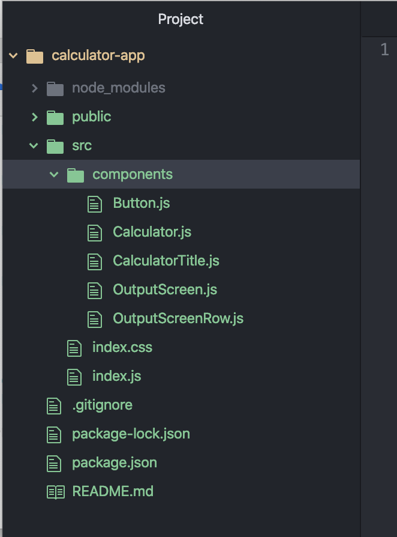
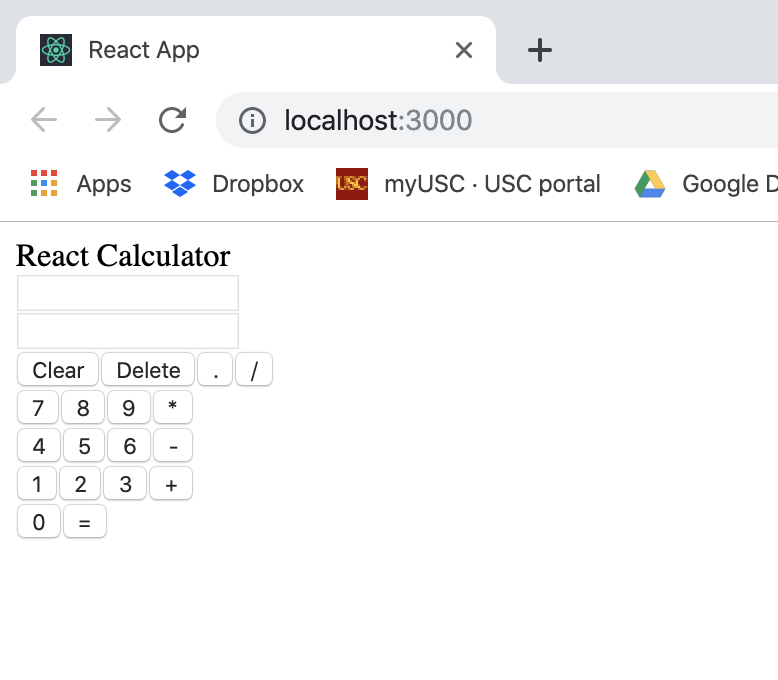
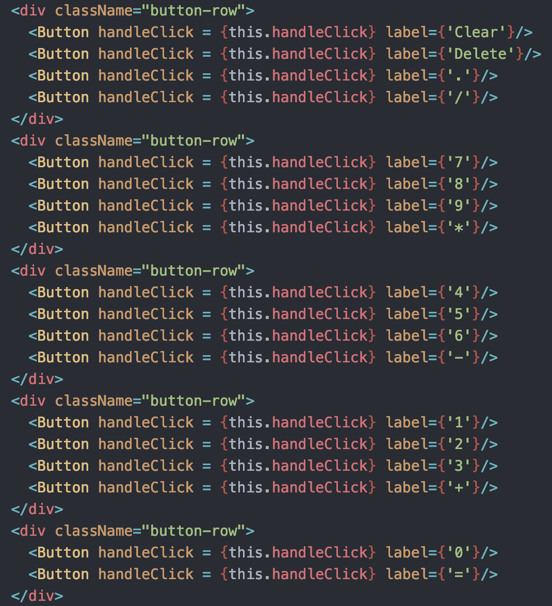

# Lesson #7: Making Interactive Portfolio
We will be building a mini interactive portfolio website using JQuery and BootStrap within Javascript

## Setup

1. We will first create a folder named myPortfolio.


2. Open your myPorfolio using any editor of your choice and create a file named  `index.html`.


3. Add a file named `index.css` in the `src/` folder. You can do this by opening up the `calculator-app` project in Atom or your IDE and creating a file through there.

4. Add a file named `index.js` in the `src/` folder.

We will need a total of five components as shown below:

* Calculator: This will be the parent component and will represent the entire Calculator application as a whole.
* CalculatorTitle: This component will be used to render the title at the top of our application, “React Calculator”.
* OutputScreen: This Component will be for all of the text shown on the screen.
* OutputScreenRow: This component will be for the type of output, i.e. input text and calculated result.
* Button: This component will be for all of the buttons that we have in our application.

Lets create a new folder named `components` inside our `src` folder and create five files inside this folder for the components mentioned above. The names of these files will be same as that of the component’s name. Our project directory will look like the below image after creating all files:



Lets start out with the `Calculator` class. After we import react, we do not need to render anything in this file so we will not import react-dom. We will export the module as default as well. As a member function, we will create a dummy render() function.

```js 
import React from 'react'; 
  
// Create a Class Component Calculator. 
class Calculator extends React.Component { 
    render() 
    { 
        return "React Calculator"; 
    } 
} 
  
// Export Calculator. 
export default Calculator; 
```

The `CalculatorTitle` component will display the title be passed by its parent using props. So for the sake of simplicity, we will be creating a functional component using the thick arrow method. The following will be what the code for `calculatorTitle.js`.

```js
import React from 'react'; 
  
// Create Functional Component. 
// Takes title as props.value. 
const CalculatorTitle = (props) => { 
  return ( 
    <div className="calculator-title"> 
      { props.value }  
    </div> 
  ) 
} 
  
export default CalculatorTitle; 
```

Now, we will work with the output screen and the component `OutputScreenRow`. For the screen row, we will be using an input field and make it readOnly so that the user can’t modify the value.

```js
import React from 'react'; 
  
// Functional Component. 
// Used to show Question/Answer. 
const OutputScreenRow = () => { 
  return ( 
    <div className="screen-row"> 
      <input type="text" readOnly/> 
    </div> 
  ) 
} 
  
export default OutputScreenRow; 
```

Our `OutputScreen` will consist of two `OutputScreenRow`s. So we will be importing the `OutputScreenRow` component we just created. We will add a `render` function that will consist of two `OutputScreenRow` components. 

```js
import React from 'react'; 
// Import Output Screen Row. 
import OutputScreenRow from './OutputScreenRow.js'; 
  
// Functional Component. 
// Use to hold two Screen Rows. 
const OutputScreen = () => { 
  return ( 
    <div className="screen"> 
      <OutputScreenRow/> 
      <OutputScreenRow/> 
    </div> 
  ) 
} 
  
export default OutputScreen; 
```

Now that we have created the screen part, what is left is the Keypad. The keypad will be a set of `Button`s. Each  `Button` will be an independent component. Use the following code:

```js
import React from 'react'; 
  
// Create our Button component as a functional component. 
const Button = (props) => { 
  return ( 
    <input 
      type="button"
      value={props.label} 
    /> 
  ); 
} 
  
export default Button; 
```

Now that we have completed developing the smaller components, we will assemble the app to look more like a calculator. Go back to the `Calculator.js` file we created and update the render function. We will add the `CalculatorTitle`, the `OutputScreen` component, and rows of `Button`s. Thus we need to import the necessary components. After updating, the file `Calculator.js` will look like the following.

```js
// Imports. 
import React from 'react'; 
import CalculatorTitle from './CalculatorTitle.js'; 
import OutputScreen from './OutputScreen.js'; 
import Button from './Button.js'; 
  
class Calculator extends React.Component { 
    render() 
    { 
    return ( 
    <div className="frame"> 
	    <CalculatorTitle value="React Calculator"/> 
	    <div class="mainCalc"> 
		    <OutputScreen/> 
		    <div className="button-row"> 
		      <Button label={'Clear'}/> 
		      <Button label={'Delete'}/> 
		      <Button label={'.'}/> 
		      <Button label={'/'}/> 
		    </div> 
		    <div className="button-row"> 
		      <Button label={'7'}/> 
		      <Button label={'8'}/> 
		      <Button label={'9'}/> 
		      <Button label={'*'}/> 
		    </div> 
		    <div className="button-row"> 
		      <Button label={'4'}/> 
		      <Button label={'5'}/> 
		      <Button label={'6'}/> 
		      <Button label={'-'}/> 
		    </div> 
		    <div className="button-row"> 
		      <Button label={'1'}/> 
		      <Button label={'2'}/> 
		      <Button label={'3'}/> 
		      <Button label={'+'}/> 
		    </div> 
		    <div className="button-row"> 
		      <Button label={'0'}/> 
		      <Button label={'='}/> 
		    </div> 
	    </div> 
    </div> 
    ); 
  } 
} 
   
export default Calculator; 
```

So far we have created all the components and stacked them together to create the basic structure. Now we just need to import the calculator in the `index.js` file and render in there. We will need to import react and react-dom and we will use the render method of ReactDOM to render the calculator component. The `index.js` file’s contents are shown below.

```js
import React from 'react'; 
import ReactDOM from 'react-dom'; 
import Calculator from './components/Calculator.js'; 
  
// Render the Calculator to the Web page. 
ReactDOM.render(<Calculator />, document.getElementById('root')); 

```

If you run `npm start` and open up localhost:3000, you should get something that looks like this:



If you click the buttons nothing is getting typed on the screen. Now we have to implement the working logic of this calculator.

To handle the click events, we will create a new function named `handleClick` and will add this function to our Calculator component class. But, you can see that the buttons from “0-9” and operators like “+,-,*,/” will have different roles. So, what we can do is inside the `handleClick` function we will use a `switch..case` statement to perform different operations on clicking different buttons.

We need to create two states for our Calculator application and we will update these two states according to the user inputs. The two states that we need are:
 

* question: Initially this state will be initialized with an empty string. This state will be used to store the user input.
* answer: Initially this state will be initialized with an empty string. This state will be used to store the result of the evaluation of user input stored in the state question.

Add the below code at the top of the `Calculator` class. This code will create the required states for us:

```js
constructor() { 
    super(); 
  
    // set our default state 
    this.state = { 
      question: '', 
      answer: ''
    } 
  
    // Bind our handleClick method (sets 'this' explicitly 
    // to refer to this componenent) We did this because 'this' 
    // would refer to the source of the click events 
    this.handleClick = this.handleClick.bind(this); 
  } 
```

Since now we have created our states to store the user input and answers. Let’s just complete our `handleClick` function to update these states according to different button clicks.

Add the below function to the `Calculator` class in the `Calculator.js` file:

```js
// our method to handle all click events from our buttons 
handleClick(event){ 
 
  // get the value from the target element (button) 
  const value = event.target.value; 
 
  switch (value) { 
    case '=': { 
 
      // if it's an equal sign, use the eval module 
      // to evaluate the question ,convert the answer 
      // (in number) to String 
      if (this.state.question!=='') 
      { 
          var ans=''; 
            try
              { 
                  ans = eval(this.state.question); 
              } 
              catch(err) 
              { 
                  this.setState({answer: "Math Error"}); 
              } 
              if (ans===undefined) 
                  this.setState({answer: "Math Error"}); 
 
              // update answer in our state. 
              else
                  this.setState({ answer: ans , question: ''}); 
              break; 
          } 
    } 
    case 'Clear': { 
 
      // if it's the Clears sign, just clean our  
      // question and answer in the state 
      this.setState({ question: '', answer: '' }); 
      break; 
    } 
 
    case 'Delete': { 
      var str = this.state.question; 
        str = str.substr(0,str.length-1); 
        this.setState({question: str}); 
        break; 
    } 
 
  default: { 
 
      // for every other command, update the question in the state 
      this.setState({ question: this.state.question += value}) 
      break; 
    } 
  } 
} 
```

Now, we are done with adding all functionalities but still, if we click the buttons in the browser, nothing will happen. The reason is because we have not linked our `handleClick` function with the button’s `onClick` attribute in our `Button` component. To do so, we will pass the `handleClick` function as props to the `Button` component and assign this function to the button’s `onClick` event.

In the Calculator component, add the following line to every Button component:

```js
handleClick = {this.handleClick}
```

The Calculator classs should look like this:



After adding this, we will go to the `Button.js` file, and add the below attribute to the input field:

```js
onClick = {props.handleClick}
```

We still have not passed the states to the `OutputScreen` component. So our `OutputScreen` component has nothing to render on screen. So, let’s update our `OutputScreen` and `OutputScreenRow` components to accept props and pass the question and answer states from `Calculator` component to the `OutputScreen` component.

Find the `OutputScreen` tag in `Calculator.js` and change it to pass question and answer.

```js
<OutputScreen question={this.state.question} answer = {this.state.answer}/>
```


Below is our final `OutputScreen.js` file:

```js
import React from 'react';   
// Import Output Screen Row. 
import OutputScreenRow from './OutputScreenRow.js'; 
  
// Functional Component. 
// Use to hold two Screen Rows. 
const OutputScreen = (props) => { 
  return ( 
    <div className="screen"> 
      <OutputScreenRow value = {props.question}/> 
      <OutputScreenRow value = {props.answer}/> 
    </div> 
  ) 
} 
  
export default OutputScreen; 
```

Below is our final `OutputScreenRow.js` file:

```js
import React from 'react'; 

// Functional Component. 
// Used to show Question/Answer. 
const OutputScreenRow = (props) => { 
  return ( 
    <div className="screen-row"> 
      <input type="text" readOnly value = {props.value}/> 
    </div> 
  ) 
} 
   
export default OutputScreenRow; 
```

Now we've successfully created a fully functional calculator application using React.

If you want to add some styling, follow [this](https://www.geeksforgeeks.org/reactjs-calculator-app-styling/) article.
